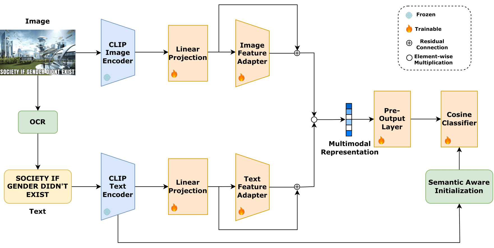

<h1 font-size:40px align="center">MemeCLIP: Leveraging CLIP Representations for Multimodal Meme Classification</h2>
<h3 font-size:40px align="center">Siddhant Bikram Shah, Shuvam Shiwakoti, Maheep Chaudhary, Haohan Wang</h3>

<p align="center">
  
</p>

This is the code repository for our paper **<a href="https://aclanthology.org/2024.emnlp-main.959/">MemeCLIP: Leveraging CLIP Representations for Multimodal Meme Classification**</a> published in EMNLP 2024.

<!-- **Abstract**: The complexity of text-embedded images presents a formidable challenge in machine learning given the need for multimodal understanding of the multiple aspects of expression conveyed in them. While previous research in multimodal analysis has primarily focused on singular aspects such as hate speech and its subclasses, our study expands the focus to encompass multiple aspects of linguistics: hate, target, stance, and humor detection. We introduce a novel dataset PrideMM comprising text-embedded images associated with the LGBTQ+ Pride movement, thereby addressing a serious gap in existing resources. We conduct extensive experimentation on PrideMM by using unimodal and multimodal baseline methods to establish benchmarks for each task. Additionally, we propose a novel framework MemeCLIP for efficient downstream learning while preserving the knowledge of the pre-trained CLIP model. The results of our experiments show that MemeCLIP achieves superior performance compared to previously proposed frameworks on two real-world datasets. We further compare the performance of MemeCLIP and zero-shot GPT-4 on the hate classification task. Finally, we discuss the shortcomings of our model by qualitatively analyzing misclassified samples. -->

## PrideMM Dataset

The images and labels for the PrideMM dataset are available <a href="https://drive.google.com/file/d/17WozXiXfq44Z6kkWsPPDHRzqIH2daUaQ/view?usp=sharing">here</a> <strong>(Warning: Insensitive content)</strong>.

## Annotation Terminology

### Hate
|  Class | Terminology | 
| :--------: | :--------: | 
| No Hate | 0 | 
| Hate | 1 | 

### Targets of Hate
|  Class | Terminology | 
| :--------: | :--------: | 
| Undirected | 0 | 
| Individual | 1 | 
| Community | 2 | 
| Organization | 3 |

### Stance
|  Class | Terminology | 
| :--------: | :--------: | 
| Neutral | 0 | 
| Support | 1 | 
| Oppose | 2 | 

### Humor
|  Class | Terminology | 
| :--------: | :--------: | 
| No Humor | 0 | 
| Humor | 1 | 

## MemeCLIP Code

All experimental changes can be made through a single file: configs.py. 

Directory names can be set in the following variables:

+ cfg.root_dir 
+ cfg.img_folder
+ cfg.info_file 
+ cfg.checkpoint_path
+ cfg.checkpoint_file

To train, validate, and test MemeCLIP, set cfg.test_only = False and run main.py.

To test MemeCLIP, set cfg.test_only = True and run main.py.

CSV files are expected to contain image path, text, and label in no particular order.

## Pre-trained Weights

Pre-trained weights for MemeCLIP (Hate Classification Task) are available <a href="https://drive.google.com/file/d/1sUlHw5fSvzPRnMu_K4uzHQY-df3E2pSi/view?usp=sharing">here</a>.

## Citation

```
@inproceedings{shah2024memeclip,
    title = "MemeCLIP: Leveraging CLIP Representations for Multimodal Meme Classification",
    author = "Shah, Siddhant Bikram  and
      Shiwakoti, Shuvam  and
      Chaudhary, Maheep  and
      Wang, Haohan",
    booktitle = "Proceedings of the 2024 Conference on Empirical Methods in Natural Language Processing",
    month = nov,
    year = "2024",
    address = "Miami, Florida, USA",
    publisher = "Association for Computational Linguistics",
    url = "https://aclanthology.org/2024.emnlp-main.959/",
    doi = "10.18653/v1/2024.emnlp-main.959",
    pages = "17320--17332",
}
```

OR

Siddhant Bikram Shah, Shuvam Shiwakoti, Maheep Chaudhary, and Haohan Wang. 2024. MemeCLIP: Leveraging CLIP Representations for Multimodal Meme Classification. In Proceedings of the 2024 Conference on Empirical Methods in Natural Language Processing, pages 17320–17332, Miami, Florida, USA. Association for Computational Linguistics.


